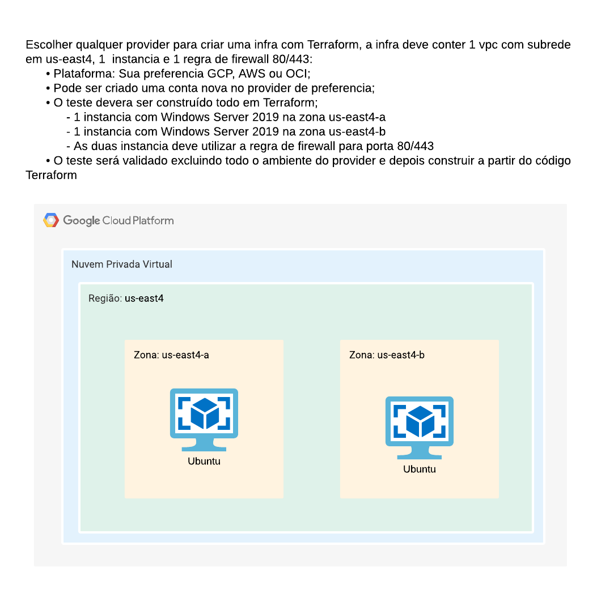

# Terraform-gpc-study
IAC em Terraform.

## Requisitos:
- Terraform
- Plataforma Cloud: GCP

## terraform-Conceito
- Estruturas bases do Terraform.

## terraform-test
- tf-challenge: desafio principal, criar uma infraestrutura com o Terraform, contendo 1 vpc com subrede em us-east4, 2 instâncias e 1 regra de firewall 80/443:
    - 1 instância com Ubuntu na zona us-east4-a.
    - 1 instância com Ubuntu na zona us-east4-b.
#

#

- tf-kubernetes: experimentos com Kubernetes e Terraform.

## Execução:

Vá até a pasta com os arquivos Terraform (.tf) pelo terminal de comando e  execute os seguites comandos:

        # inicia o Terraform
        terraform init

        # cria um plano de execução do Terraform        
        terraform plan

        # executa a criação da infraestrutura
        terraform apply

        # destrói a infraestrutura criada
        terraform destroy
