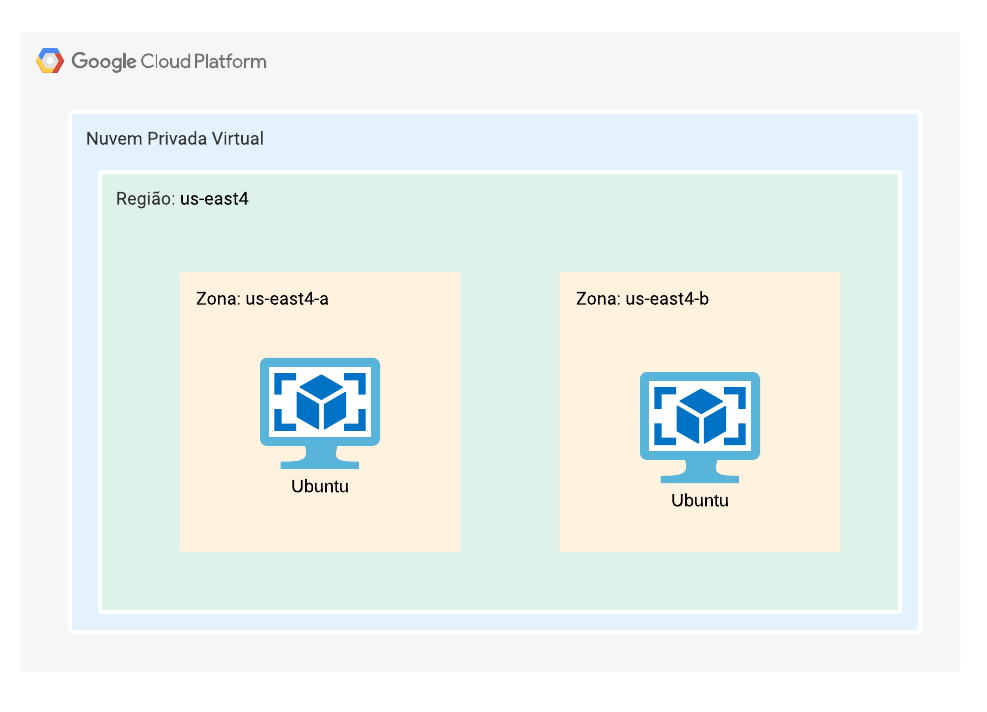

# Terraform-gpc-study
Infra As Code em Terraform.

## Por que esse repositório está Público
Recomendo a todos que estão ainda no começo de sua trajetória se aprofundar o máximo possível nos fundamentos de lógica de programação, pois será sua base em tudo que fará na sua jornada de programação. Por esse motivo mantenho todos os meus repositórios de estudo abertos para quem quiser utilizar como base em seus estudos. 

## Lembre-se: 
Saber a linguagem não é tão importante quanto saber como usá-la para resolver problemas.

## Requisitos:
- Terraform
- Plataforma Cloud: GCP

# Estrutura do Repositório:

## terraform-Conceito
- Estruturas bases do Terraform.

## terraform-test
- tf-challenge: desafio principal, criar uma infraestrutura com o Terraform, contendo 1 vpc com subrede em us-east4, 2 instâncias e 1 regra de firewall 80/443:
    - 1 instância com Ubuntu na zona us-east4-a.
    - 1 instância com Ubuntu na zona us-east4-b.
#

#

- tf-kubernetes: experimentos com Kubernetes e Terraform.

## Execução:

Vá até a pasta com os arquivos Terraform (.tf) pelo terminal de comando e  execute os seguites comandos:

        # inicia o Terraform
        terraform init

        # cria um plano de execução do Terraform        
        terraform plan

        # executa a criação da infraestrutura
        terraform apply

        # destrói a infraestrutura criada
        terraform destroy
